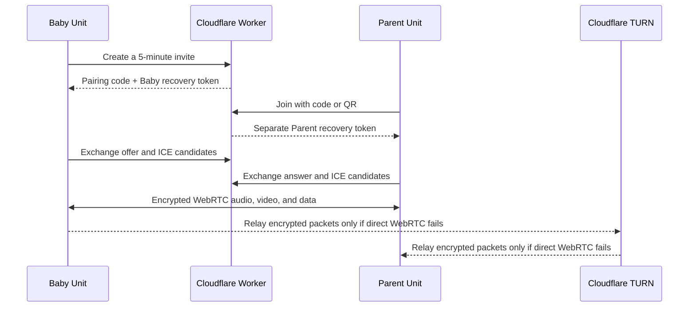

# Nappio

[](LICENSE)
[](https://github.com/tmoreton/nappio/actions/workflows/quality.yml)

Nappio turns phones into a private baby monitor. One phone is the **Baby Unit** and sends its camera and microphone to as many as three **Parent Units**. Each Parent can watch, listen with the screen locked, switch to audio only, or hold to talk back.

The media path is peer to peer whenever the network allows it. A small Cloudflare Worker coordinates pairing and WebRTC signaling, while Cloudflare TURN is used only when a direct connection is blocked. Nappio has no accounts and does not record audio or video.

> Nappio is not a medical device and is not a substitute for direct adult supervision.

- [Project website](https://tmoreton.github.io/nappio/)
- [Contributing](CONTRIBUTING.md)
- [Security policy](SECURITY.md)
- [Apache-2.0 license](LICENSE)

## How it works



1. The Baby Unit asks the Worker for a room. The Worker returns a six-digit code, a QR-compatible deep link, and a role-scoped recovery token.
2. The code stays usable for five minutes, so as many as three Parent Units can join the same room. Every Parent gets an independent recovery token.
3. Each device exchanges a single-use signaling ticket for a WebSocket. The Worker relays only the WebRTC offer, answer, and ICE candidates needed to connect the phones.
4. The Baby Unit creates one `RTCPeerConnection` per Parent. Camera and microphone media use encrypted DTLS-SRTP; small control messages and Baby battery status use the WebRTC data channel.
5. WebRTC first tries a direct route. If NAT or a firewall prevents that, the same encrypted packets travel through Cloudflare TURN. TURN can forward those packets but cannot decode the media.
6. Holding **Talk** adds the Parent microphone in the reverse direction. **Audio Only** tells the Baby Unit to stop sending video to that Parent without interrupting audio.
7. Saved role sessions renew during authenticated use and expire after 30 days. Ending the Baby session revokes the room; ending or replacing a Parent session revokes only that Parent.

### What the service handles

| Data | Where it goes | Retention |
| --- | --- | --- |
| Camera, microphone, and talk-back media | Directly between phones, or encrypted through TURN | Not stored by Nappio |
| Pairing code and random room identifier | Cloudflare Durable Object | Pairing code expires after 5 minutes; room data expires with its sessions |
| Session recovery credential | Stored on-device; only its SHA-256 hash is stored by the Worker | Rolling 30-day expiry |
| WebRTC offers and ICE candidates | Hibernating Worker WebSockets | Relayed in memory, not intentionally persisted |
| Random installation ID and network address | Layered pairing-abuse counters | Short rate-limit windows; address log retention follows the deployer's Cloudflare settings |
| Connection route (`direct` or `relay`) | Anonymous Worker operational log | Controlled by the deployer's Cloudflare log settings |
| One-way room attribution ID | Cloudflare TURN credentials and analytics | Controlled by the deployer's TURN and analytics settings |

Cloudflare may process network metadata and operational logs under its own terms. See the [privacy implementation notes](docs/app-store-privacy.md) before operating a public deployment.

## Architecture

- **Mobile app:** Expo SDK 57, React Native, and Expo Router.
- **Realtime media:** `@livekit/react-native-webrtc` provides the native WebRTC implementation. `@livekit/react-native` is used for native audio-session setup only; Nappio does not use a LiveKit server or SFU.
- **Pairing and signaling:** a Cloudflare Worker routes rooms across 100 SQLite-backed Durable Object shards. A shard makes create/join operations atomic and owns the room's hibernating signaling WebSockets.
- **Network fallback:** Cloudflare's free STUN endpoint helps establish direct connections. Short-lived TURN credentials are generated by the Worker when TURN is configured.
- **Local secrets:** installation IDs and recovery tokens use iOS Keychain or Android Keystore through Expo SecureStore.
- **Alerts:** sound, power, and interruption alerts are calculated locally. Nappio does not register for remote push notifications.

The separate peer connection per Parent keeps the server simple and avoids an always-on media service. The tradeoff is that the Baby phone uploads one stream per connected Parent and therefore uses more battery and upstream bandwidth as the room grows.

## Repository layout

| Path | Purpose |
| --- | --- |
| `src/app` | Expo Router screens and the static project website |
| `src/realtime` | Native WebRTC peers, signaling client, and protocol validation |
| `src/pairing` | Pairing API client, codes, installation ID, and response types |
| `src/monitoring` | Local alerts, preferences, audio detection, and Baby device status |
| `src/livekit` | Native WebRTC global and audio-session integration |
| `worker` | Cloudflare Worker, Durable Object, tests, and Wrangler configuration |
| `test` | Platform-independent app unit tests |
| `scripts` | Bounded load and TURN-usage checks |
| `docs` | Production, privacy, release, and store documentation |

## Requirements

- Node.js 22.13 or newer
- Xcode 26.4 or newer for SDK 57 iOS builds, or the corresponding Android toolchain
- Two physical phones for the main flow; three or four for multi-Parent testing
- A custom development build because native WebRTC is not included in Expo Go
- A Cloudflare account to deploy the pairing Worker
- A Cloudflare Realtime TURN key for reliable operation across restrictive networks

## Quick start

Install both dependency sets:

```sh
npm install
npm --prefix worker install
```

Create local Worker secrets and run the Worker:

```sh
cp worker/.dev.vars.example worker/.dev.vars
# Set SESSION_SECRET to a random value of at least 32 characters.
npm run worker:dev
```

Create the app environment file and set `EXPO_PUBLIC_API_BASE_URL`:

```sh
cp .env.example .env
```

Wrangler normally listens on `http://127.0.0.1:8787`. A physical phone cannot use that loopback address; use your computer's reachable LAN address or deploy the Worker over HTTPS.

Build the native development client on each phone, then start Metro:

```sh
npx expo run:ios --device
npx expo start --dev-client --lan
```

Use `npx expo run:android --device` for Android. Open Nappio on both phones, choose **Use as Baby Camera** on one, and **Monitor Baby** on the other.

## Self-host the backend

The hosted endpoint used by official Nappio builds is not a shared public backend for forks. A fork or redistributed build should deploy its own Worker and TURN key.

1. Sign in to Cloudflare and choose a unique Worker name plus a unique positive integer for `ratelimits[0].namespace_id` in `worker/wrangler.jsonc`.
2. Create a Realtime TURN key in the Cloudflare dashboard or with the API. Keep its token ID and API token server-side; never place them in an `EXPO_PUBLIC_` variable.
3. Deploy once so Cloudflare provisions the SQLite Durable Object namespace:

   ```sh
   npx wrangler login
   npm run worker:deploy
   ```

4. Add the three Worker secrets:

   ```sh
   npx wrangler secret put SESSION_SECRET --config worker/wrangler.jsonc
   npx wrangler secret put TURN_KEY_ID --config worker/wrangler.jsonc
   npx wrangler secret put TURN_KEY_API_TOKEN --config worker/wrangler.jsonc
   ```

5. Point `EXPO_PUBLIC_API_BASE_URL` in `.env` at the HTTPS URL printed by Wrangler and rebuild the app.

Without the TURN secrets, the Worker deliberately returns only Cloudflare's STUN server. That is often enough on the same Wi-Fi network, but connections can fail on carrier, hotel, school, or corporate networks. Cloudflare documents the current [TURN setup](https://developers.cloudflare.com/realtime/turn/generate-credentials/) and [TURN pricing](https://developers.cloudflare.com/realtime/turn/faq/).

### Give a fork its own app identity

The checked-in Expo identifiers belong to the official Nappio build. Set these build-time values in your fork's `.env` before creating native or EAS builds:

```dotenv
NAPPIO_EXPO_OWNER=your-expo-account
NAPPIO_EXPO_SLUG=your-project-slug
NAPPIO_EAS_PROJECT_ID=00000000-0000-0000-0000-000000000000
NAPPIO_IOS_BUNDLE_IDENTIFIER=com.example.nappio
NAPPIO_ANDROID_PACKAGE=com.example.nappio
```

If you do not use EAS, remove or replace the official `owner`, `extra.eas`, `updates`, and store submission values in `app.json` and `eas.json`. The repository's deployment workflows are intentionally limited to `tmoreton/nappio`; a fork can adapt those guards and secrets for its own infrastructure.

## Verify changes

Run the repeatable local checks:

```sh
npm run check
npx expo-doctor
EXPO_WEB_BASE_URL=/nappio npx expo export --platform web
npm --prefix worker run deploy -- --dry-run
```

For a bounded API probe, start the local Worker and run `npm run worker:load-test`. It creates 25 rooms by default, ends every room it creates, and refuses to target a production URL unless `ALLOW_PRODUCTION_LOAD_TEST=true` is explicitly set.

Automated checks cannot validate camera, background audio, Bluetooth routing, radio transitions, or real TURN behavior. Complete the [physical-device test checklist](docs/physical-device-testing.md) before a production release.

## Operating the official deployment

- [Production runbook](docs/production-runbook.md)
- [Launch checklist](docs/launch-checklist.md)
- [App Store metadata draft](docs/app-store-metadata.md)
- [App Store privacy notes](docs/app-store-privacy.md)

The official workflows require repository and environment secrets for Cloudflare and Expo. No secret belongs in source control, an issue, a screenshot, or an app-visible environment variable.

## Contributing

Bug reports and focused pull requests are welcome. Read [CONTRIBUTING.md](CONTRIBUTING.md) before changing the signaling protocol, permissions, background behavior, or privacy surface. Report vulnerabilities privately according to [SECURITY.md](SECURITY.md).

## License

Nappio is licensed under the [Apache License 2.0](LICENSE). Dependencies retain their own licenses. The `private` fields in the package manifests only prevent accidental publication to npm; they do not make the source proprietary.
